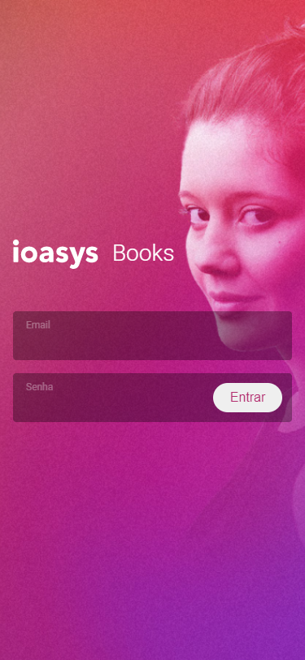
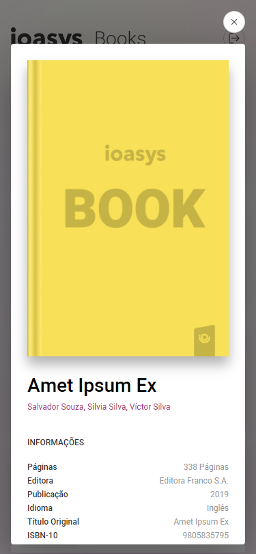
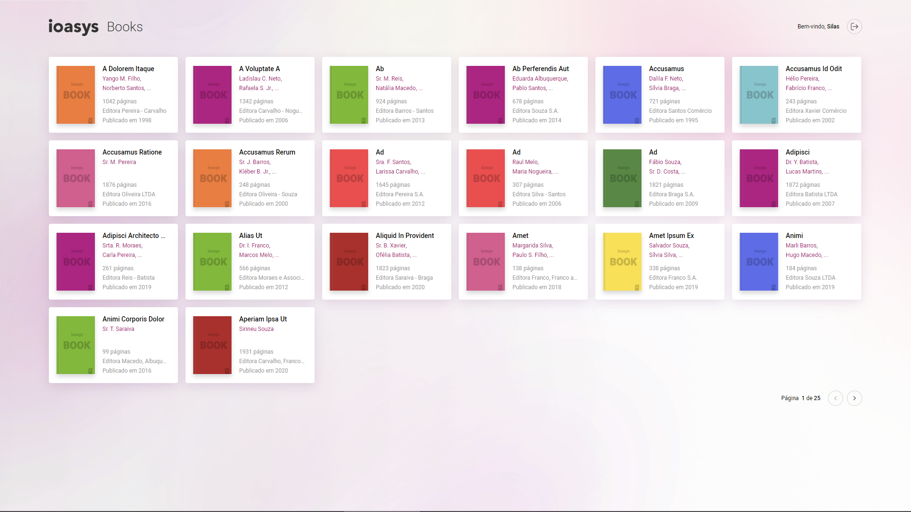
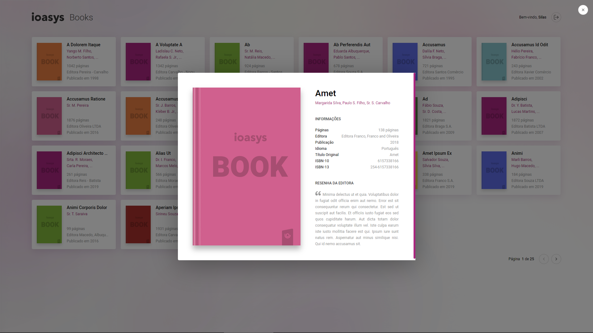

### Desafio Ioasys Books Front-End

Este documento README tem como objetivo fornecer instruções para instalação e execução do projeto e dos testes implementados para o desafio **ioasys books**.

- Para instalar, basta executar os seguintes comandos na raiz do projeto:

```
yarn
yarn start
```

- Para iniciar os testes:

```
yarn test
```

- Mobile (Iphone X)

<div align="center">
  
  
  
  
  
  
</div>

- Desktop (1920x1080)

<div align="center">
  
  
  
</div>
